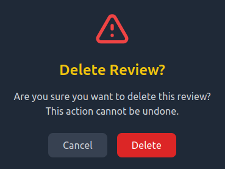

# 🎮 Fantasy Ecommerce Store

A unique e-commerce platform that combines traditional online shopping with gaming elements. This project showcases a full-stack web application where users can play minigames, earn coins, and purchase virtual items in a fantasy-themed environment.

<div align="center">
  
  <p><em>The Website's Index Page</em></p>
</div>

## 📸 Screenshots

<div align="center">
  
  <p><em>A Common Store Item</em></p>
</div>

<div align="center">
  
  <p><em>The 64 minigame, a simpler version of 2048</em></p>
</div>

<div align="center">
  
  <p><em>The Inventory Management System</em></p>
</div>

<div align="center">
  
  <p><em>The Review Management System</em></p>
</div>

## ✨ Features

### Core Features
- 🏪 Virtual store with fantasy-themed items
- 💰 Points-based currency system
- 🎮 Interactive minigames
- 🔐 User authentication system with JWT

### User Experience
- 📦 Intuitive inventory management
- ⭐ Product reviews and ratings
- 📱 Responsive, game-inspired UI

## 🛠️ Tech Stack

### Frontend
- ⚛️ React 18 with Vite
- 🎨 Tailwind CSS for styling
- 🎮 Kaboom.js for mini-games
- 📝 TypeScript for type safety
- 🔄 Redux for state management

### Backend
- 🟢 Node.js runtime
- 🚂 Express.js framework
- 📊 MongoDB database
- 🔒 JWT Authentication
- 🔄 RESTful API
- ✨ ESLint v9 and Prettier

## 📁 Project Structure

```
ecommerce-game/
├── client/                      # React frontend
│   ├── src/
│   │   ├── assets/             # Images and static files
│   │   ├── components/         # Reusable React components
│   │   │   ├── auth/          # Authentication components
│   │   │   ├── inventory/     # Inventory management
│   │   │   ├── layout/        # Layout components (navbar, footer)
│   │   │   ├── minigames/     # Minigame-related components
│   │   │   ├── modals/        # Modal dialogs
│   │   │   ├── reviews/       # Review system components
│   │   │   └── store/         # Store components
│   │   ├── pages/             # Main application pages
│   │   ├── services/          # API and service integrations
│   │   ├── store/             # Redux store configuration
│   │   │   └── slices/        # Redux slices
│   │   ├── types/             # TypeScript interfaces
│   │   └── utils/             # Utility functions
│   └── public/                 # Public assets
├── server/                      # Node.js backend
│   ├── src/
│   │   ├── config/            # Configuration files
│   │   │   └── db.js         # Database configuration
│   │   ├── controllers/       # Request handlers
│   │   ├── database/          # Database store items dump
│   │   ├── middleware/        # Custom middleware
│   │   ├── models/            # Database models
│   │   └── routes/            # API routes
│   └── public/                 # Static files
│       └── images/            # Game item images
│           ├── weapons/       # Weapon images
│           ├── helmets/       # Helmet images
│           ├── chestpieces/   # Chestpiece images
│           ├── boots/         # Boot images
│           └── potions/       # Potion images
└── README.md
```

## 🚀 Getting Started

### Prerequisites
- Node.js 22+
- MongoDB 8.x
- npm or yarn
- TypeScript-aware IDE (recommended)

### Installation

1. Clone the repository
```bash
git clone https://github.com/vladcranga/ecommerce-game.git
cd ecommerce-game
```

2. Install frontend dependencies
```bash
cd client
npm install
```

3. Install backend dependencies
- Currently, the dependency "eslint-config-airbnb-base" does not support ESLint v9+, so we run npm install --legacy-peer-deps.
```bash
cd ../server
npm install --legacy-peer-deps
```

4. Set up MongoDB
- Make sure MongoDB is installed and running on your system
  - Check if MongoDB is running on Linux
    ```bash
    systemctl status mongod
    ```
  - Start or enable MongoDB on Linux if it's not running
    ```bash
    systemctl start mongod
    systemctl enable mongod
    ```
- The database and collections will be created automatically when the server starts
- Import the store items data located at `server/src/database/fantasy-game-store.items.json`:
```bash
mongoimport --db fantasy-game-store --collection items --file server/src/database/fantasy-game-store.items.json --jsonArray
```

5. Environment Setup
- Create a `.env` file in the server directory with the following variables:
```
PORT=5000
MONGODB_URI=mongodb://localhost:27017/fantasy-game-store
JWT_SECRET=your_jwt_secret_here
```

6. Start the web application
- Start the backend server:
```bash
cd server
npm run dev
```
- In a new terminal, start the frontend:
```bash
cd client
npm run dev
```

The frontend should now be running at `http://localhost:3000` with the backend API at `http://localhost:5000`.

### Admin Setup
To gain access to admin functionality, you'll need to:
1. Register a new user through the web application
2. Manually update the user's role to "admin" in the MongoDB database:
```bash
mongosh
use fantasy-game-store
db.users.updateOne({email: "your_email@example.com"}, {$set: {isAdmin: true}})
```

## 🤝 Contributing

Contributions are welcome! Please feel free to submit a Pull Request.

## 📝 License

This project is intended for personal portfolio purposes only. All game assets and images are either AI-generated or sourced from copyright-free sources with proper attribution where required.