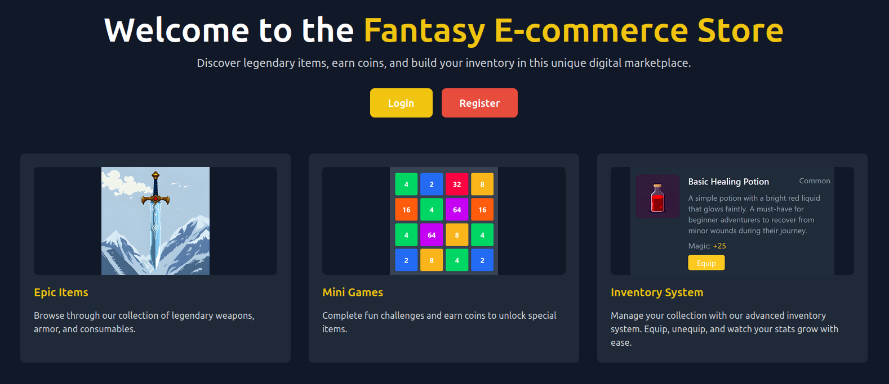
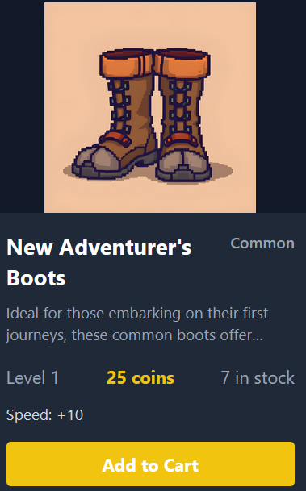
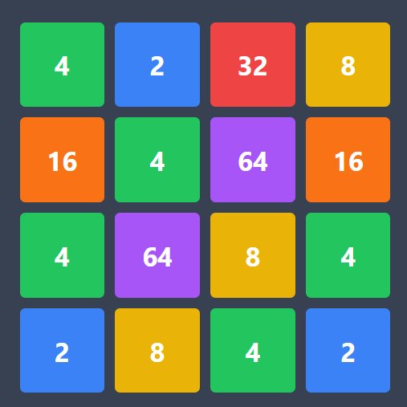
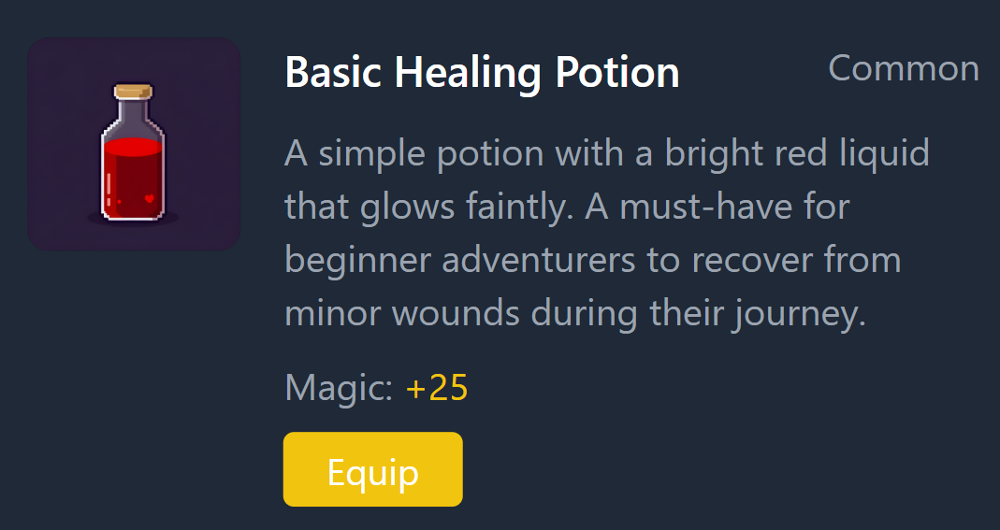

# 🎮 Fantasy Ecommerce Store

A unique e-commerce platform that combines traditional online shopping with gaming elements. This project showcases a full-stack web application where users can play minigames, earn coins, and purchase virtual items in a fantasy-themed environment.

<div align="center">
  
  <p><em>The Website's Index Page</em></p>
</div>

## 📸 Screenshots

<div align="center">
  
  <p><em>A Common Store Item</em></p>
</div>

<div align="center">
  
  <p><em>The 64 minigame, a simpler version of 2048</em></p>
</div>

<div align="center">
  
  <p><em>The Inventory Management System</em></p>
</div>

## ✨ Features

### Core Features
- 🔐 User authentication system with JWT
- 🏪 Virtual store with fantasy-themed items
- 💰 Points-based currency system
- 🎮 Interactive minigames

### User Experience
- 📦 Intuitive inventory management
- ⭐ Product reviews and ratings
- 📱 Responsive, game-inspired UI

## 🛠️ Tech Stack

### Frontend
- ⚛️ React 18 with Vite
- 🎨 Tailwind CSS for styling
- 🎮 Kaboom.js for mini-games
- 📝 TypeScript for type safety
- 🔄 Redux for state management

### Backend
- 🟢 Node.js runtime
- 🚂 Express.js framework
- 📊 MongoDB database
- 🔒 JWT Authentication
- 🔄 RESTful API

## 📁 Project Structure

```
ecommerce-game/
├── client/                 # React frontend
│   ├── src/
│   │   ├── assets/        # Images and static files
│   │   ├── components/    # Reusable React components
│   │   ├── pages/         # Main application pages
│   │   └── store/         # Redux store configuration
│   └── public/            # Public assets
├── server/                 # Node.js backend
│   └── src/
│       ├── controllers/   # Request handlers
│       ├── models/        # Database models
│       ├── routes/        # API routes
│       └── middleware/    # Custom middleware
└── README.md
```

## 🚀 Getting Started

### Prerequisites
- Node.js 18+
- MongoDB
- npm or yarn

### Installation

1. Clone the repository
```bash
git clone https://github.com/vladcranga/ecommerce-game.git
cd ecommerce-game
```

2. Install frontend dependencies
```bash
cd client
npm install
```

3. Install backend dependencies
```bash
cd ../server
npm install
```

4. Start the development servers
```bash
# Terminal 1 - Frontend
cd client
npm run dev

# Terminal 2 - Backend
cd server
npm run dev
```

## 🤝 Contributing

Contributions are welcome! Please feel free to submit a Pull Request.

## 📝 License

This project is intended for educational purposes only. All game assets and images are either AI-generated or used from copyright-free sources with proper attribution.